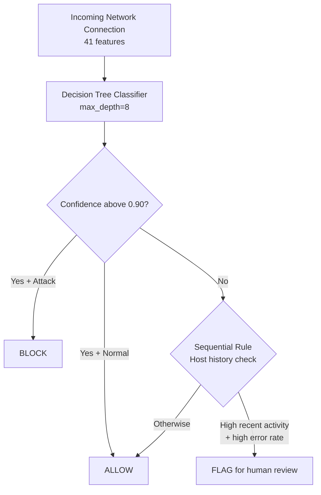
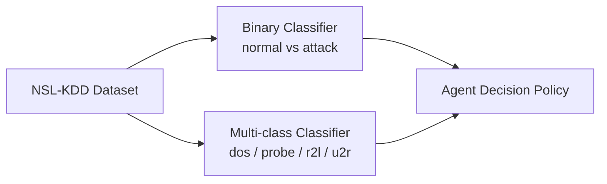
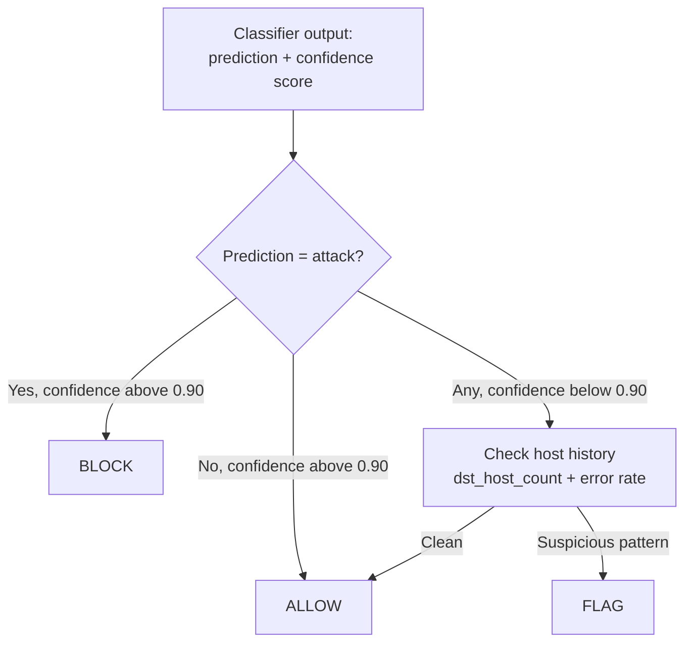
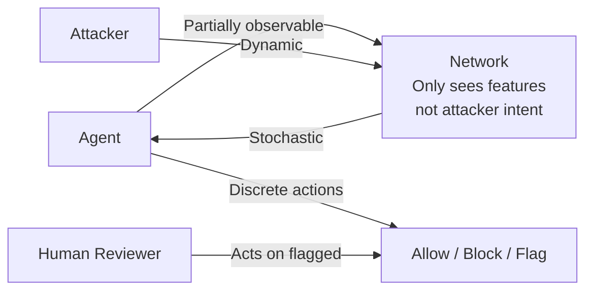

# Network Intrusion Detection Agent

An ML-based network security agent that decides whether to allow, block, or flag network connections in real time. Built on the NSL-KDD dataset using Python and scikit-learn, with a confidence-threshold decision policy and sequential host-memory logic.

---

## How It Works



The agent does not give a binary answer. It combines a classifier's prediction and confidence score with a sequential memory of recent host traffic to make a three-way decision: allow, block, or flag for human review.

---

## Dataset

NSL-KDD, available on Kaggle: https://www.kaggle.com/datasets/hassan06/nslkdd

| Split | Rows | Notes |
|-------|------|-------|
| Training | 125,973 | Used to train both models |
| Test | 22,544 | Contains unseen attack types not in training |

41 features covering duration, protocol type, byte counts, error rates, and host-based traffic statistics. Labels: normal or 1 of 22+ attack categories grouped into 4 classes: DoS, Probe, R2L, U2R.

---

## Models



Two Decision Tree classifiers trained (max_depth=8):

**Binary** distinguishes normal traffic from any attack. Used as the primary signal.

**Multi-class** identifies the attack category. Used to provide context when the agent flags a connection.

---

## Results

| Model | Test Set | Accuracy | Notes |
|-------|----------|----------|-------|
| Binary | Random split | 99.4% | Inflated, seen attack types only |
| Binary | Real test set | 77% | Adversarial, unseen attack types |
| Multi-class | Random split | 99.4% | Inflated |
| Multi-class | Real test set | 83.8% | True generalization performance |

The 15.6 point gap between random split and real test set reflects the difficulty of generalizing to unseen attack types. The reported real-world performance is 83.8%.

---

## Agent Decision Policy



The sequential rule re-evaluated 307 originally-allowed connections using host traffic history. Of those, 282 were confirmed real attacks. This shows the value of memory beyond a single-connection view.

---

## Feature Importance

The Decision Tree relies most heavily on src_bytes (source byte count), which alone accounts for roughly 75% of split importance. Secondary features include protocol type, destination host service count, and error rates.

---

## Limitations

Rare attack categories (R2L and U2R) are almost never caught, with recall around 0.01 to 0.11. This is caused by severe class imbalance: U2R has roughly 40 training examples versus 13,000 normal connections. The agent is not safe to fully automate without a human-in-the-loop fallback for flagged connections.

Improvements would include class balancing (SMOTE or class weights) and ensemble models (Random Forest, XGBoost).

---

## Environment



The environment is partially observable, stochastic, sequential, dynamic, and multi-agent. The attacker is actively sending connections while the agent deliberates, and a human reviewer handles flagged cases.

---

## Requirements

```bash
pip install pandas numpy scikit-learn matplotlib seaborn
```

---

## Running the Notebook

```bash
git clone https://github.com/Manal-Razak/network-intrusion-detection-agent.git
cd network-intrusion-detection-agent
```

Download the NSL-KDD dataset from Kaggle and place it in the working directory, then run the notebook top to bottom.

---

## Repository Structure

```
network-intrusion-detection-agent/
    network_intrusion_detection_agent.ipynb
    requirements.txt
    README.md
    .gitignore
```

---

## References

- Dataset: NSL-KDD, https://www.kaggle.com/datasets/hassan06/nslkdd
- Original KDD Cup 1999 dataset paper: Tavallaee et al., 2009
- Grad-CAM: not applicable (Decision Tree model)

---

## Author

Manal Abdul Razak Mohammed  
Software Engineering Student, University of Europe for Applied Sciences, Potsdam  
https://github.com/Manal-Razak
